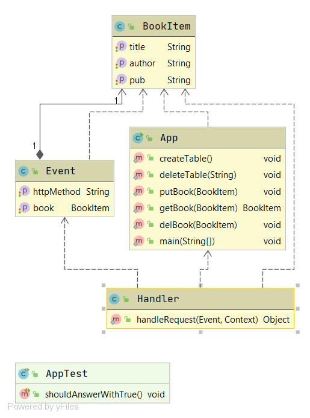

# API For Lib Mgmt System

## Functionalities
- Creating and adding books to database
- Retrieving data from database
- Deleting data
## Technologies
- Java
- AWS Lambda
- AWS DynamoDb
- AWS API Gateway
- Maven
## Instructions to run
Invoke the given URL with following payload schema and corresponding method:-

**URL**:- https://rt2zjx8ak9.execute-api.us-east-1.amazonaws.com/test/library/book
```$xslt
{
    "title":"value",
    "author":"value,
    "pub":"value"
}
```
**DB Schema**
```$xslt
{
    "Table": {
        "AttributeDefinitions": [
            {
                "AttributeName": "author",
                "AttributeType": "S"
            },
            {
                "AttributeName": "title",
                "AttributeType": "S"
            }
        ],
        "TableName": "Books",
        "KeySchema": [
            {
                "AttributeName": "title",
                "KeyType": "HASH"
            },
            {
                "AttributeName": "author",
                "KeyType": "RANGE"
            }
        ],
        "TableStatus": "ACTIVE",
    
    }
}
```
**Classes**
```
- Handler = Lambda handler class
- BookItem = POJO for DB ojects
- Event = POJO for requests
- App = Provides CRUD methods

```
## UML Diagram and Screenshots

.png)
.png)
.png)


